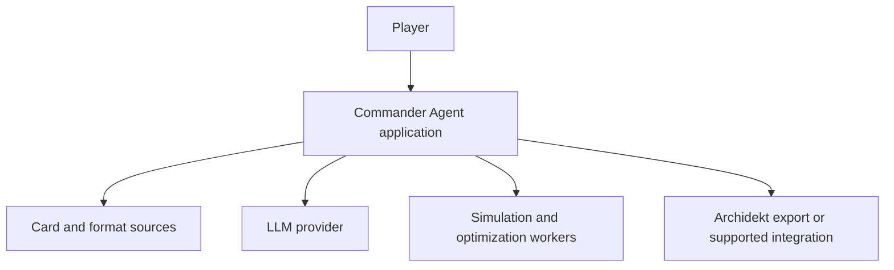
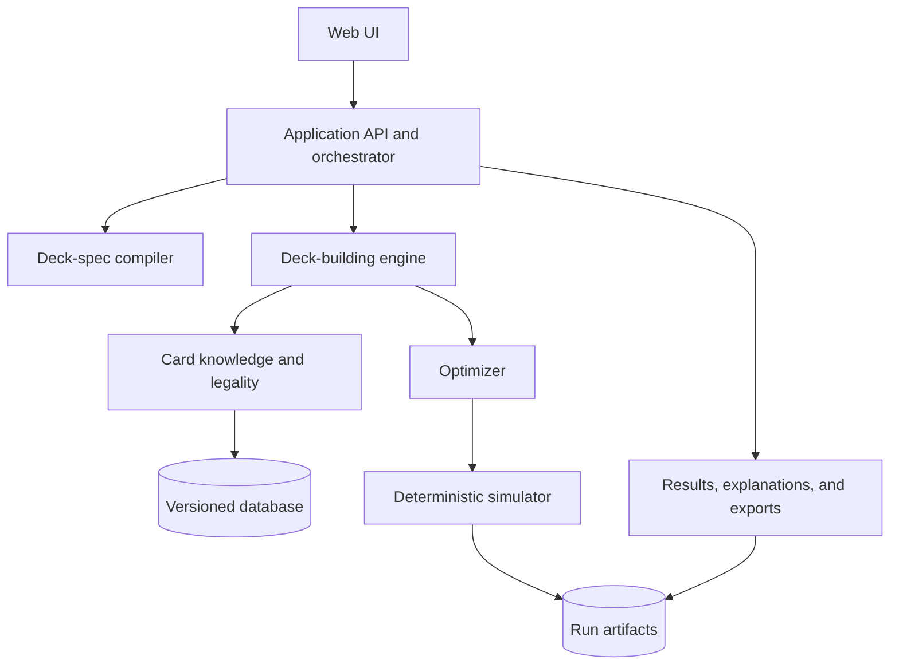

# MTG Commander Deck Optimization Agent

## High-Level Design

| Field | Value |
|---|---|
| Status | Approved product-review baseline; CP-11 active |
| Version | 1.1 |
| Date | 2026-08-20 |
| Product owner | User |
| Initial reference commander | Kenessos, Priest of Thassa |
| Intended audience | Product owner, implementation agents, reviewers, and future maintainers |
| Source-of-truth intent | This document governs the system shape until superseded by a later version or an accepted architecture decision record (ADR). |

---

## 1. Executive summary

The system will help a player build a legal 100-card Magic: The Gathering Commander deck that maximizes explicitly requested strategic outcomes while respecting theme, budget, collection, power, and play-style preferences.

The first reference request is:

> Build a fishing-themed Kenessos, Priest of Thassa deck using top-deck manipulation, with the highest practical probability of using Kenessos to put a large eligible creature onto the battlefield by turn 4.

The product is not merely a conversational card recommender. It is a hybrid system with four distinct responsibilities:

1. An authoritative, versioned card-knowledge layer.
2. An AI interface that translates natural-language intent into a structured deck specification.
3. A deterministic legality, simulation, and optimization engine that measures deck performance under declared assumptions.
4. A user application that explains results and exchanges deck lists with Archidekt.

The initial architecture is a modular monolith. Modules communicate through versioned contracts so high-cost components—especially simulation, optimization, ingestion, and AI inference—can move to independent workers or services later without redesigning the product.

The system will report measurable claims such as:

> In 100,000 simulations under interaction profile I, ruleset R, mulligan policy M, and deck-data snapshot D, 68.1% ± 0.3% of games put a mana-value-6-or-greater eligible creature onto the battlefield with Kenessos by the end of turn 4; 81% of successful games retain at least one declared continuation path.

It will not claim that a deck is objectively “perfect.” It will identify the best deck found for a specific goal specification, simulation model, candidate pool, and compute budget.

---

## 2. Document contract and change protocol

### 2.1 Purpose

This HLD exists to:

- Preserve the product’s intent across implementation sessions and future agents.
- Prevent early implementation shortcuts from silently becoming architecture.
- Define stable module boundaries and versioned data contracts.
- Divide work into independently verifiable checkpoints.
- Make every probability claim reproducible.
- Allow the system to scale continuously without prematurely introducing distributed-system complexity.

### 2.2 Rules for future changes

Future agents must not silently change the meaning of goals, probability metrics, deck legality, or simulation assumptions.

A change requires one of the following:

- A compatible clarification recorded in the document changelog.
- An ADR for a structural or irreversible decision.
- A new HLD version for a material product or architecture change.

Each implementation checkpoint must update `STATUS.md` with:

- Checkpoint identifier and status.
- Scope completed.
- Files or modules changed.
- Tests and evaluation results.
- Assumptions introduced.
- Known limitations.
- Recommended next action.

### 2.3 Decision hierarchy

When documents conflict, use this order:

1. Latest explicit product-owner instruction.
2. Accepted ADR.
3. Latest HLD version.
4. Active checkpoint specification.
5. `STATUS.md` implementation notes.
6. Code comments and local assumptions.

---

## 3. Problem definition

### 3.1 User problem

Commander deck construction combines several difficult tasks:

- Searching a continuously growing card pool.
- Enforcing commander color identity, singleton, banned-list, and special construction rules.
- Recognizing mechanical roles and multi-card synergies that are not represented by rarity or card type alone.
- Balancing mana, setup pieces, payoffs, protection, interaction, and recovery.
- Preserving a creative theme without making the deck nonfunctional.
- Estimating how frequently a specific sequence occurs by a requested turn.
- Understanding why one card improves or reduces consistency.

Existing deck recommendation systems often rank popular or semantically related cards. This product must additionally optimize and measure a user-defined game plan.

### 3.2 Core product claim

Given:

- A commander or commander pair.
- One or more strategic milestones.
- Target turn numbers.
- Hard constraints.
- Soft preferences.
- A declared game and opponent model.

The system produces:

- A legal deck candidate.
- The estimated probability of each milestone by its target turn.
- Confidence intervals and simulation assumptions.
- Explanations of card roles and important synergies.
- Alternative cards and the estimated effect of each swap.
- An Archidekt-compatible export.

### 3.3 Hard constraints versus soft objectives

The system must never blur these concepts.

| Type | Examples | Behavior |
|---|---|---|
| Hard constraint | Exactly 100 cards; commander legality; color identity; singleton rule; banned cards; maximum budget; excluded card | Candidate is invalid if violated. |
| Guardrail | Minimum land count; minimum interaction; minimum theme score; maximum Game Changers | Candidate is normally invalid, but the user may explicitly relax it. |
| Optimization objective | Put an eligible creature into play by turn 4; assemble a combo by turn 7 | Optimizer maximizes the measured probability. |
| Preference | Fishing artwork; low salt; favorite cards; avoid tutors | Used as a weighted score or tie-breaker. |
| Reporting dimension | Price, rarity, bracket, card ownership | Shown even when it is not optimized. |

---

## 4. Goals and non-goals

### 4.1 Product goals

1. Maintain current structured knowledge of the Magic card corpus without relying on model memory.
2. Build only legal Commander decks unless a rule-zero exception is explicitly requested.
3. Translate natural-language intent into an inspectable, editable, versioned specification.
4. Classify cards into multiple functional and thematic roles with provenance and confidence.
5. Estimate milestone probabilities by turn number using reproducible simulations.
6. Optimize the deck against multiple goals without sacrificing required gameplay guardrails.
7. Explain recommendations, failure modes, and card-swap tradeoffs in player-friendly language.
8. Support an iterative workflow: create, evaluate, lock cards, swap cards, compare versions, and export.
9. Produce Archidekt-compatible output first and pursue deeper integration only through a supported mechanism.
10. Scale from one local user to concurrent cloud jobs without changing domain contracts.
11. Treat early-turn goals as strategy milestones, then preserve and evaluate ways to convert those milestones into wins.

### 4.2 Initial non-goals

1. Implementing every rule and interaction in the complete Magic Comprehensive Rules.
2. Claiming exact multiplayer win probability without an explicit opponent and interaction model.
3. Modeling table politics, negotiation, threat perception, or human misplays in the first release.
4. Automatically writing to Archidekt through undocumented private endpoints.
5. Providing real-time card-market purchasing or financial advice.
6. Supporting every unusual commander construction exception in the first validator release.
7. Training a foundation model from scratch.
8. Treating EDH popularity as proof that a card is optimal for the user’s goal.

---

## 5. Success criteria

### 5.1 Product-level success

- A user can describe a commander, theme, milestones, and constraints conversationally.
- The generated structured specification matches the user’s intent and can be edited before a build begins.
- Every proposed deck passes deterministic legality validation.
- Every reported probability includes a run manifest and uncertainty estimate.
- The Kenessos reference deck can be generated, simulated, optimized, explained, compared, and exported end to end.
- The user can lock or ban cards and rerun optimization without rebuilding the system.
- A build must distinguish early setup success from overall strategic success and identify at least one credible continuation/win path.

### 5.2 Quality targets for the first usable release

| Dimension | Initial target |
|---|---|
| Legality | 100% pass rate on supported Commander legality fixtures |
| Reproducibility | Same dataset, engine version, deck, policy, and seed produce identical event counts |
| Data traceability | Every card and classification references a source snapshot/version |
| Simulation correctness | Primitive mechanics agree with deterministic unit fixtures and exact probability checks where available |
| Optimization value | Optimized Kenessos deck beats the frozen baseline on the primary milestone using paired seeds and a statistically meaningful margin without materially degrading approved continuation/win-path guardrails |
| Explainability | Every included nonland card has at least one declared role; every recommendation cites evidence from card data or simulation |
| Responsiveness | Interactive validation and card search feel immediate; long simulations run as cancellable background jobs |

Numeric latency and accuracy service-level objectives will be set after the first benchmark checkpoint rather than guessed in advance.

---

## 6. Primary user experience

### 6.1 Build flow

1. User selects or names a commander and bracket from 1–5.
2. The application retrieves a broad curated set of mechanics available to that commander.
3. The user selects mechanics and may enter a custom idea; custom input must map visibly to registered gameplay components before optimization.
4. The AI compiles the choices into a `DeckSpec` and the application shows material assumptions.
5. The knowledge, legality, simulation, and optimization engines solve an exact 100-slot functional template.
6. The application presents the template as the primary result so the player retains card-level expression.
7. On request, the builder produces a legal example deck that traces every card to the template quantities.
8. The simulator and optimizer measure the example and present Pareto alternatives without hiding tradeoffs.
9. The user can revise the template, inspect explanations, and export either the template or a plain importer-safe example list.

### 6.2 Iteration flow

The user may:

- Lock required cards.
- Exclude cards.
- Change a milestone or its turn.
- Increase theme strength.
- Adjust budget or Game Changer policy.
- Import an existing deck as the baseline.
- Compare two deck versions using identical simulation conditions.
- Request “make this more reliable,” “make this less powerful,” or “keep the strategy but add more interaction.”

Every iteration creates a new immutable `DeckVersion`; it does not silently overwrite the evidence for an older result.

---

## 7. System context



The application owns the product logic. External systems provide facts, language inference, compute, or presentation interoperability; none of them is the system of record for a build’s assumptions or results.

---

## 8. Logical architecture



### 8.1 Architectural style

Start as a modular monolith with explicit ports and adapters:

- Domain packages contain no UI, database, LLM-provider, or Archidekt-specific code.
- External integrations implement interfaces owned by the domain/application layer.
- Simulation and optimization run behind job interfaces even when initially executed in-process.
- Stored objects carry schema versions.
- Long-running tasks are cancellable and idempotent.

This approach optimizes early development speed while preserving extraction paths for independently scalable workers.

### 8.2 Major modules

#### A. Card ingestion

Responsibilities:

- Download authoritative source snapshots.
- Normalize Oracle cards separately from printings.
- Preserve source identifiers and timestamps.
- Compute hashes and reject incomplete snapshots.
- Produce immutable dataset versions.
- Trigger derived-feature reprocessing only when relevant fields change.

#### B. Card knowledge

Responsibilities:

- Query card facts, legalities, color identity, types, costs, Oracle text, rulings, printings, prices, rarity, and images.
- Maintain multi-label mechanical and thematic classifications.
- Store classification confidence and provenance.
- Represent relationships such as “enables,” “pays off,” “tutors,” “protects,” “conflicts,” and “is a legal target for.”
- Support lexical, structured, and semantic retrieval.

#### C. Legality and constraint engine

Responsibilities:

- Validate deck size, commander eligibility, color identity, singleton rules, banned cards, and supported special construction rules.
- Apply user hard constraints and guardrails.
- Return machine-readable violations with suggested remediations.
- Remain deterministic and independent of an LLM.

#### D. Deck-spec compiler

Responsibilities:

- Convert conversation into a versioned structured specification.
- Separate hard constraints, guardrails, objectives, preferences, and assumptions.
- Resolve card names and ambiguous terminology.
- Mark inferred values so the UI can distinguish them from explicit user choices.
- Reject unsupported goals rather than inventing a measurement.

#### E. Candidate retrieval and classification

Responsibilities:

- Generate a legal candidate pool from structured filters, tags, text retrieval, embeddings, and curated synergy rules.
- Assign multiple roles per card.
- Explain why each card is a candidate.
- Preserve low-popularity but mechanically strong options.
- Prevent the LLM from directly selecting arbitrary cards outside the validated candidate pool.

#### F. Baseline deck builder

Responsibilities:

- Construct an initial legal deck using commander-specific and generic role requirements.
- Choose a functional mana base.
- Respect locked, excluded, owned-only, budget, and bracket constraints.
- Produce a reproducible baseline for optimization.

#### G. Simulation engine

Responsibilities:

- Execute supported game mechanics using a deterministic pseudo-random number generator.
- Model draws, mulligans, turns, mana, commander casting, card zones, supported actions, and milestone events.
- Use an explicit action policy rather than allowing an LLM to improvise each simulated game.
- Emit aggregate results plus optional traces for debugging.
- Support progressive simulation fidelity.

#### H. Optimizer

Responsibilities:

- Search legal deck configurations.
- Evaluate swaps with common random numbers to reduce noise.
- Maximize multiple milestone objectives under constraints.
- Return a Pareto frontier when objectives conflict.
- Calculate marginal card and package contributions.
- Stop according to compute budget and convergence rules.

#### I. AI adviser and explanation layer

Responsibilities:

- Lead the product conversation.
- Compile and revise specifications using structured output.
- Summarize validated card facts and simulation evidence.
- Explain tradeoffs and failure modes.
- Never override deterministic legality or fabricate an unmeasured probability.

#### J. Results, versions, and reporting

Responsibilities:

- Store immutable deck versions, build runs, run manifests, metrics, traces, comparisons, and explanations.
- Present confidence intervals and assumptions next to probability results.
- Reevaluate old deck versions on a newer dataset or engine without erasing old results.

#### K. Archidekt adapter

Responsibilities:

- Generate a supported text/CSV export with commander and categories.
- Import a user-provided Archidekt deck as a baseline where supported.
- Encapsulate any future authenticated integration behind `DeckPublisher` and `DeckImporter` interfaces.
- Never store a user password or depend on undocumented write endpoints.

---

## 9. Core domain model

### 9.1 Primary entities

| Entity | Purpose |
|---|---|
| `CardOracle` | Rules-level identity and current Oracle characteristics of a unique card. |
| `CardPrinting` | Set, collector number, language, rarity, art, finish, and price-specific data. |
| `CardClassification` | Versioned mechanical/theme tags, confidence, and provenance. |
| `FormatSnapshot` | Banned list, Game Changers, bracket rules, and effective date. |
| `DeckSpec` | User intent compiled into constraints, objectives, preferences, and assumptions. |
| `DeckVersion` | Immutable commander, card list, categories, provenance, and parent version. |
| `ActionPolicy` | Deterministic rules for mulligans, sequencing, targeting, and resource use. |
| `SimulationScenario` | Game model, player position, interaction assumptions, turn horizon, and policy. |
| `RunManifest` | All versions, seeds, samples, and configuration required to reproduce a result. |
| `GoalResult` | Success count, estimate, interval, failure reasons, and turn distribution. |
| `BuildRun` | Candidate generation, optimization history, selected decks, and result references. |

### 9.2 Versioned `DeckSpec` example

```json
{
  "schemaVersion": "deck-spec/1",
  "commander": {
    "oracleId": "resolved-at-runtime",
    "name": "Kenessos, Priest of Thassa"
  },
  "format": {
    "name": "commander",
    "snapshotId": "commander-format-YYYY-MM-DD",
    "gameChangerPolicy": { "mode": "max-count", "value": 3 }
  },
  "hardConstraints": {
    "budgetUsd": null,
    "lockedCards": [],
    "excludedCards": [],
    "ownedOnly": false
  },
  "guardrails": {
    "minLands": 35,
    "minInteraction": 8,
    "minThemeScore": 0.65
  },
  "objectives": [
    {
      "id": "kenessos-hit-t4",
      "metric": "kenessos_qualified_creature_entered",
      "deadline": { "turn": 4, "boundary": "end-step" },
      "qualification": {
        "eligibleTypes": ["Kraken", "Leviathan", "Octopus", "Serpent"],
        "minManaValue": 6
      },
      "priority": 1,
      "weight": 1.0
    }
  ],
  "strategyPlan": {
    "setupMilestoneId": "kenessos-hit-t4",
    "continuationRequirements": [
      "repeatable-engine-or-second-threat",
      "commander-protection-or-recovery",
      "sufficient-mana-and-card-access"
    ],
    "minimumDeclaredWinPaths": 1,
    "winPaths": []
  },
  "preferences": {
    "themes": ["fishing", "ocean", "sea monsters"],
    "mechanics": ["scry", "top-deck manipulation"],
    "avoid": []
  },
  "scenario": {
    "model": "commander-removal-stress-v1",
    "onPlay": true,
    "mulliganPolicyId": "goal-aware-london-v1",
    "diagnosticGoldfishBaseline": true,
    "opponentInteraction": {
      "commanderRemoval": {
        "enabled": true,
        "profile": "moderate-v1"
      }
    }
  },
  "inferences": [
    {
      "path": "/guardrails/minThemeScore",
      "reason": "Defaulted because user requested a strongly themed deck"
    }
  ]
}
```

The UI must show inferred values before an expensive optimization run. Mana value 6, a maximum of three Game Changers, inclusion of commander removal, and the local-first/export-first approach are approved product defaults. The exact theme threshold and the timing/frequency parameters inside `moderate-v1` still require calibration and must remain visible.

### 9.3 Goal-definition registry

Natural-language goals are compiled into registered, typed goal definitions. Each goal definition supplies:

- A versioned identifier and parameter schema.
- A precise success event and deadline boundary.
- Required simulator capabilities.
- Sub-events and failure-reason categories.
- Validation rules and user-facing explanation text.

The LLM may select and parameterize a registered goal, but it may not invent executable probability metrics. A request that cannot be represented by an existing goal must either be decomposed into supported goals or marked unsupported until a new tested definition is added. This registry is the primary extension point for continuously adding commanders and strategies.

---

## 10. Card knowledge design

### 10.1 Source strategy

Initial sources:

1. **Scryfall Oracle Cards bulk data** for normalized card facts and legalities.
2. **Scryfall print data** only when printing, rarity, image, or price matters.
3. **Scryfall Oracle and art tags** as community-maintained classification inputs, not unquestioned truth.
4. **Scryfall rulings** when a supported mechanic needs clarification.
5. **Wizards/official Commander sources** for Commander rules, banned-list, brackets, and Game Changers.
6. **Project-curated taxonomy and interaction rules** for functional roles and simulator primitives.

Community deck statistics or combo databases may be evaluated later, subject to licensing, attribution, rate limits, and terms of service. They are optional evidence sources, not foundations for legality.

### 10.2 Knowledge layers

| Layer | Examples | Update behavior |
|---|---|---|
| Raw facts | Oracle text, mana cost, type line, color identity, legality, rarity | Rebuilt from source snapshots. |
| Deterministic derived facts | Mana value bands, commander legality, eligible Kenessos creature type | Recomputed by code. |
| Curated taxonomy | Ramp, protection, top-deck setup, payoff, interaction | Reviewed project data with version history. |
| Model-derived labels | Fishing theme, sequencing complexity, semantic similarity | Stored with model/prompt version and confidence. |
| Empirical evidence | Marginal probability contribution, common failure reason | Produced by simulation against a specific spec/scenario. |

### 10.3 Multi-label role taxonomy

A card may have many roles. Initial top-level roles include:

- Mana: land, fixing, ramp, ritual, cost reduction.
- Access: draw, selection, scry, surveil, tutor, recursion.
- Setup: top-deck reorder, top-deck placement, type manipulation, enabler.
- Payoff: eligible hit, finisher, combo piece, value engine.
- Interaction: removal, counterspell, board wipe, stack interaction, graveyard interaction.
- Resilience: protection, redundancy, recursion, recovery.
- Tempo: haste, flash, untap, extra activation.
- Theme: fishing, ocean, aquatic art, sea creature, sailor, boat.
- Social/power: tutor intensity, fast mana, Game Changer, salt-sensitive pattern.

Role assignment must retain provenance: deterministic rule, curated annotation, source tag, model classification, or empirical result.

---

## 11. Simulation strategy

### 11.1 Progressive fidelity

| Level | Model | Purpose |
|---|---|---|
| L0 | Static combinatorics and hypergeometric checks | Validate simple draw probabilities and detect obvious deck-ratio issues. |
| L1 | Deterministic goldfish turn simulator | Diagnostic baseline for setup mechanics and probability checks. |
| L1R | Commander-removal resilience model | Required initial Kenessos scenario; model removal timing, commander tax, protection, recovery, and alternate lines. |
| L2 | Broader interaction stress model | Add configurable counterspells, wipes, graveyard interaction, and timing hazards. |
| L3 | Archetypal opponent policies | Estimate performance against representative pods. |
| L4 | Learned or search-based policies | Research stage; only if evidence shows value over explicit policies. |

The product must label every result with its fidelity level. Goldfish remains a diagnostic baseline, but the default optimized result includes the L1R commander-removal scenario. Neither result may be presented as multiplayer win probability.

### 11.2 Supported-state approach

The first simulator will not attempt full rules-engine completeness. It will model the mechanics required by an explicit supported-card set using composable effect primitives, such as:

- Draw and conditional draw.
- Scry and look/reorder top cards.
- Put a known card on top.
- Land play and mana production.
- Permanent-based ramp and cost reduction.
- Cast commander and supported spells.
- Kenessos activation and eligible creature entry.
- Selected protection and interaction events in later fidelity levels.

Unsupported cards may still appear in a deck, but their effects must be classified as one of:

- Statistically modeled abstraction.
- Static effect understood by the simulator.
- Ignored for the selected metric with a visible coverage warning.
- Disallowed from optimization for that scenario.

The engine must report mechanic coverage for each evaluated deck.

### 11.3 Action policy

A simulation policy controls decisions such as:

- Whether to mulligan and which cards to bottom.
- Which land to play.
- Whether to cast ramp or the commander.
- When to hold mana.
- How to order top-deck effects and activations.
- Which eligible creature to place or retain on top.

Initial policies will be explicit heuristics with unit tests. Later, search or learned policies may replace a heuristic behind the same interface. The LLM is not in the per-game simulation loop because that would be slow, expensive, and non-reproducible.

### 11.4 Probability reporting

Every reported estimate must include:

- Number of samples.
- Success count.
- Point estimate.
- Confidence or credible interval method.
- Turn distribution.
- Top failure reasons.
- Scenario and policy identifiers.
- Dataset, format, engine, and goal-definition versions.
- Seed or seed-range identifier.
- Mechanic coverage.

Sequential sampling may stop early only when a documented precision target or candidate-elimination rule is satisfied.

---

## 12. Optimization strategy

### 12.1 Objective formulation

The optimizer operates in this order:

1. Enforce legality and hard constraints.
2. Enforce user-approved guardrails.
3. Maximize primary milestone probability.
4. Preserve commander-removal resilience and approved post-milestone continuation requirements.
5. Optimize secondary milestones, recovery, and declared win-path strength.
6. Improve theme, budget, preference, and simplicity scores.
7. Present nondominated alternatives when objectives conflict.

A single weighted score may be used internally for a search stage, but the final UI must show the underlying dimensions.

### 12.2 Search stages

1. **Candidate-pool construction:** legal cards plus relevant packages and lands.
2. **Baseline construction:** role-aware heuristic deck.
3. **Fast screening:** static features and low-sample simulations.
4. **Local improvement:** greedy or beam search over card/package swaps.
5. **Global exploration:** evolutionary or other population search if local search stalls.
6. **High-confidence reevaluation:** paired high-sample comparison of finalists.
7. **Sensitivity analysis:** estimate important inclusions, fragile packages, and tradeoffs.

The search algorithm is replaceable. The durable contract is: candidates in, constrained `DeckVersion` alternatives plus evidence out.

### 12.3 Variance control

When comparing deck A to deck B:

- Use the same seed set where valid.
- Compare paired outcomes.
- Avoid declaring an improvement when the interval includes a negligible effect.
- Reevaluate finalists on fresh holdout seeds to reduce optimizer overfitting.

### 12.4 Guarding against pathological decks

Maximizing one turn-4 event can create a deck that does nothing afterward. A turn-4 hit is therefore a setup milestone, not overall build success. The optimizer needs explicit guardrails or secondary metrics for:

- Land and color-source sufficiency.
- Interaction.
- Card advantage.
- Recovery after commander removal.
- Hit quality, not only hit frequency.
- At least one declared path that converts the established board into a win.
- Post-milestone option quality: repeat the engine, deploy a second threat, protect the board, or recover from disruption.
- Theme adherence.
- Budget and power expectations.
- Unsupported-mechanic coverage.

---

## 13. Kenessos reference vertical slice

### 13.1 Card behavior relevant to the model

Kenessos, Priest of Thassa costs `{1}{U}`. It increases the number of cards seen when its controller scries. Its `{3}{G/U}` activated ability looks at the top card and may put it onto the battlefield when it is a Kraken, Leviathan, Octopus, or Serpent creature card; the ability is limited to once each turn.

This makes the reference problem a useful combination of:

- Commander access and casting.
- Mana development.
- Top-deck information and manipulation.
- Eligible-hit density.
- Sequencing.
- Thematic scoring.

### 13.2 Primary milestone definition

`kenessos_qualified_creature_entered_by_turn_4` succeeds only if, by the configured turn-4 boundary:

1. Kenessos is on the battlefield under the player’s control.
2. Its activated ability is legally activated.
3. The top card at resolution is an eligible creature card.
4. The creature meets the approved “big creature” qualification of mana value 6 or greater.
5. The player chooses to put that card onto the battlefield.

Although the initial approved definition of “big” is mana value 6 or greater, its qualification remains explicit in `DeckSpec`, not a hidden simulator constant. The system separately reports any eligible hit and a qualified high-impact hit so low-cost eligible creatures cannot inflate the primary success metric.

This milestone does not mean the deck has “won” on turn 4. A successful deck must retain practical follow-up options and at least one declared win path. For Kenessos, candidate plans may include repeated high-impact activations, protected sea-monster combat pressure, alternate threat deployment, or another user-approved closing package. The builder proposes these paths; the user may accept, reject, or prioritize them.

Sub-events will be recorded separately:

- Kenessos cast by turn 2.
- Required activation mana available by turn 4.
- Top card known or intentionally arranged.
- Activation attempted.
- Activation hit naturally versus hit after setup.
- Any eligible creature entered.
- Qualified high-impact creature entered.
- Hit quality distribution, including mana value and an optional later threat score.
- Mana or setup bottleneck.

### 13.3 First scenario suite

The initial benchmark contains two matched scenarios:

1. **L1 goldfish diagnostic:** isolates draw, mana, setup, and activation consistency.
2. **L1R commander-removal resilience:** applies a visible, versioned removal profile and evaluates protection, commander tax, recovery, and alternate lines.

Shared rules:

- Commander multiplayer draw rules, explicitly encoded and tested.
- London mulligan with a named heuristic policy.
- No free pregame setup unless stated.
- End-of-turn-4 deadline.
- A declared supported-card/mechanic set.

The end-of-turn-4 boundary defines only the early milestone deadline. Overall deck evaluation continues after that point to assess continuation and win-path readiness. The exact removal timing and frequency belong to the versioned `moderate-v1` profile, will be calibrated during CP-05, and will always be shown with results. Later stress scenarios add countered setup spells, wipes, graveyard interaction, and multiple disrupted permanents.

### 13.4 Reference outputs

The application should show:

- Final 100-card list grouped by functional role.
- Primary and sub-event probabilities.
- Turn histogram for the first successful Kenessos hit.
- Top five failure reasons.
- Ten most important cards or packages by marginal contribution.
- Cards included mainly for theme.
- Declared continuation and win paths after the turn-4 milestone.
- Commander-removal resilience, recovery timing, and alternate-line results.
- Mechanic coverage warning.
- Comparison with the frozen baseline.
- Archidekt import text.

---

## 14. Archidekt integration strategy

### Phase A — supported export

- Produce plain-text deck list accepted by common deck importers.
- Preserve commander and custom category labels where the format permits.
- Provide one-click copy/download.
- Treat this as the required MVP integration.

### Phase B — read/import

- Accept an Archidekt deck URL or exported list supplied by the user.
- Resolve names and printings to internal identifiers.
- Create a local immutable `DeckVersion` as the optimization baseline.
- Use only supported public access and respect rate limits and terms.

### Phase C — authenticated publish/sync

- Pursue only if Archidekt offers or approves a supported write mechanism.
- Prefer user-controlled authorization.
- Keep the integration behind `DeckPublisher`.
- Make publishing an explicit user action.
- Fall back to export if the integration is unavailable.

An old Archidekt staff statement described reading as open while reserving its API primarily for Archidekt and affiliates. This is not a stable write contract; the MVP must not depend on it.

---

## 15. Suggested implementation stack

These are recommended defaults, not permanent constraints.

| Concern | Initial choice | Scale path |
|---|---|---|
| Repository | TypeScript monorepo | Preserve package contracts if services split |
| UI | Local-first React/Next.js responsive web application | PWA or desktop shell if local integration requires it; optional hosted deployment later |
| API/orchestration | Node.js/TypeScript | Independently deployable API later |
| Domain validation | TypeScript schemas with explicit versioning | Generate cross-language schemas if workers split |
| Primary database | PostgreSQL | Read replicas/partitioning only when measured need appears |
| Semantic retrieval | PostgreSQL vector extension or replaceable adapter | Dedicated vector service only if justified |
| Simulation | Deterministic TypeScript core with worker-thread interface | Port hot loops behind the interface to Rust/WASM or a native worker if profiling demands it |
| Long jobs | In-process job runner implementing a queue port | Durable queue plus autoscaled workers |
| Artifacts | Database metadata plus local/object blob storage adapter | Object storage with retention policies |
| AI provider | Provider-neutral structured-output adapter | Route models by cost/quality/evaluation result |
| Deployment | Local-first single-user application | Optional cloud environment and horizontal API/worker scaling later |

The architecture must not assume a single AI vendor or put provider SDK types in domain packages.

---

## 16. Suggested repository boundaries

```text
apps/
  web/                    # User interface
  api/                    # HTTP/API composition root
packages/
  domain/                 # Versioned entities, value objects, interfaces
  card-data/              # Ingestion, normalization, snapshots
  card-knowledge/         # Retrieval, roles, tags, graph relationships
  commander-rules/        # Deterministic legality and constraints
  deck-spec/              # Natural language -> structured specification
  deck-builder/           # Baseline construction
  simulator/              # State, actions, policies, effects, goals
  optimizer/              # Search algorithms and comparisons
  reporting/              # Metrics, explanations, exports
  integrations-archidekt/ # Import/export/publish adapter
  llm/                    # Provider adapters and prompt/eval versions
  evals/                  # Golden sets, statistical and regression suites
docs/
  HLD.md
  STATUS.md
  CHECKPOINTS.md
  adr/
  experiments/
```

Dependencies should point inward toward `domain`. Integration and application packages may depend on domain interfaces; domain must not depend on them.

---

## 17. External and internal API shape

Illustrative endpoints:

- `POST /v1/deck-specs:compile` — compile a conversation/request into an inspectable `DeckSpec`.
- `POST /v1/deck-specs/{id}:validate` — validate supported goals and constraints.
- `POST /v1/builds` — start baseline generation and optimization.
- `GET /v1/builds/{id}` — retrieve state, progress, candidates, and results.
- `POST /v1/builds/{id}:cancel` — cancel a long job idempotently.
- `POST /v1/decks:import` — import a supplied list or supported reference.
- `GET /v1/decks/{id}/versions/{version}` — retrieve an immutable deck version.
- `POST /v1/decks/{id}/versions/{version}:simulate` — run a named scenario.
- `POST /v1/decks/{id}/versions:compare` — compare versions with paired seeds.
- `POST /v1/decks/{id}/versions/{version}:export` — generate an Archidekt-compatible export.

Long-running operations return job identifiers and stream or poll progress. API idempotency keys prevent duplicate builds.

---

## 18. Reproducibility and observability

### 18.1 Required run manifest

Every build and simulation stores:

- `DeckSpec` ID and schema version.
- Deck version and exact card identifiers.
- Card dataset snapshot.
- Format snapshot.
- Classification taxonomy/model version.
- Simulator version.
- Optimizer version and configuration.
- Action policy version.
- Goal-definition version.
- Scenario version.
- Seed set.
- Sample count and stopping rule.
- LLM model and prompt version for AI-produced artifacts.
- Code revision/build identifier.

### 18.2 Operational telemetry

Collect:

- Ingestion freshness and failures.
- Classification backlog and confidence distribution.
- Candidate-pool sizes.
- Legality failure counts.
- Job queue time, runtime, cancellation, and failure reason.
- Simulations per second.
- Optimizer improvement curve.
- LLM latency, structured-output failure, token usage, and cost.
- Export/import failures.

Do not log private collection contents, credentials, or full conversations by default.

---

## 19. Testing and evaluation strategy

### 19.1 Deterministic tests

- Card normalization fixtures.
- Color-identity and singleton legality fixtures.
- Supported special commander rules.
- Mana payment and land sequencing.
- Each simulator effect primitive.
- Kenessos eligible-type detection and activation limit.
- Goal-boundary semantics.
- Export formatting.

### 19.2 Property tests

- Shuffling never changes deck composition.
- No card exists in two zones simultaneously.
- Mana cannot be spent twice.
- Deck mutation preserves legality or returns a violation.
- Same run manifest yields the same results.
- A deck comparison never uses unmatched scenario versions.

### 19.3 Statistical tests

- Simulator draw frequencies match exact small-case probabilities within declared tolerance.
- Paired comparison detects known synthetic improvements.
- Sequential stopping maintains its target error behavior.
- Holdout-seed evaluation detects search overfitting.

### 19.4 AI evaluations

A golden request set should test:

- Commander resolution.
- Hard versus soft constraint extraction.
- Target-turn boundary extraction.
- Theme extraction.
- Game Changer and budget policy.
- Ambiguous requests that require clarification.
- Unsupported claims that must be rejected.
- Explanation faithfulness to card facts and measured evidence.

### 19.5 Regression suites

Freeze representative decks and specs, including:

- Kenessos top-deck sea monsters.
- Creature tribal.
- Spellslinger.
- Graveyard recursion.
- Tokens/go-wide.
- Voltron.
- Artifact engine.
- Landfall.
- A commander with a special construction rule.
- A deck intentionally constrained by budget and zero Game Changers.

---

## 20. Security, privacy, and responsible integration

- Do not accept or store Archidekt passwords.
- Use supported authorization if authenticated publishing becomes available.
- Encrypt access tokens and collection data at rest in hosted deployments.
- Treat imported deck descriptions, external tags, and community content as untrusted data, not agent instructions.
- Restrict external requests to allowlisted providers and enforce rate/cost limits.
- Validate all LLM structured output against schemas.
- Do not execute card text, deck descriptions, or user-provided URLs as code.
- Make public sharing and publishing explicit user actions.
- Record licenses, attribution requirements, and retention policies for every dataset.

---

## 21. Scaling strategy

Scaling is trigger-based, not speculative.

| Pressure | Initial response | Extraction trigger |
|---|---|---|
| Card ingestion | Scheduled job in the application deployment | Independent service when failures or schedules interfere with user traffic |
| Simulation CPU | Worker threads/process pool | Dedicated workers when concurrent jobs cause API latency or queueing |
| Optimization duration | Progressive sampling and cancellable local jobs | Durable queue when jobs must survive process restarts |
| Database read load | Indexing, query tuning, caching | Read replicas after measured saturation |
| Vector search | PostgreSQL-based adapter | Dedicated search only if corpus/query needs exceed it |
| LLM cost | Cache structured results and route models | Multiple-provider routing after eval data supports it |
| Run artifacts | Local adapter for development | Object storage when retention or multi-worker access requires it |

Module extraction must preserve domain contracts and run-manifest semantics.

---

## 22. Risks and mitigations

| Risk | Impact | Mitigation |
|---|---|---|
| “Complete knowledge” becomes stale | Incorrect or missing recommendations | Versioned scheduled ingestion; freshness visible in UI |
| Functional tags are incomplete | Good cards omitted | Multi-source classification, provenance, review queue, and retrieval recall evals |
| Simulator cannot model a card | Probability becomes misleading | Coverage report, supported primitives, abstractions, and scenario warnings |
| Optimization overfits goldfish assumptions | Deck performs poorly in real pods | Guardrails, holdout seeds, interaction stress scenarios, and clear labels |
| Theme conflicts with consistency | User dislikes mathematically best deck | Pareto alternatives and adjustable theme threshold |
| One scalar score hides tradeoffs | Surprising recommendations | Show underlying metrics and nondominated decks |
| LLM hallucinates rules or evidence | Loss of trust | Deterministic fact retrieval and legality; evidence-bound explanations |
| Archidekt write access is unavailable | Integration stalls | Text export is the stable MVP path |
| New Commander rules/special cards appear | Validator rejects or accepts incorrectly | Versioned format rules and explicit supported exceptions |
| Simulation cost grows rapidly | Slow/expensive builds | Progressive sampling, pruning, paired seeds, parallel workers, profiling |
| Community data has licensing or availability limits | Feature removal or legal risk | Track provenance/terms; keep optional sources behind adapters |

---

## 23. Delivery checkpoints

Each checkpoint is independently reviewable. An agent should normally complete one checkpoint at a time.

### CP-00 — Foundation and governance

**Objective:** Establish the source of truth and safe project skeleton.

**Deliverables:**

- Monorepo structure and package boundaries.
- `HLD.md`, `STATUS.md`, `CHECKPOINTS.md`, and ADR template.
- Shared schema/versioning conventions.
- CI running lint, typecheck, and unit tests.
- Run-manifest schema stub.

**Exit criteria:**

- Fresh checkout has one documented setup command.
- Dependency rules prevent domain packages from importing integration packages.
- A sample run manifest validates.
- No product implementation is hidden in the foundation checkpoint.

### CP-01 — Versioned card truth

**Objective:** Ingest and query the authoritative card corpus.

**Deliverables:**

- Scryfall snapshot downloader and normalizer.
- Oracle/printing separation.
- Dataset metadata, hashes, and freshness status.
- Card lookup by name and source identifiers.

**Exit criteria:**

- All records in the selected snapshot import or fail with an explicit report.
- Reimport is idempotent.
- Kenessos resolves to one Oracle identity and its relevant facts are correct.
- Source attribution and refresh policy are documented.

### CP-02 — Commander legality engine

**Objective:** Validate deterministic deck construction.

**Deliverables:**

- Commander, color-identity, size, singleton, banned-list, and supported-exception validation.
- Versioned format snapshot.
- Structured violations.

**Exit criteria:**

- Supported legality fixture suite passes 100%.
- Invalid Kenessos off-color, duplicate, banned, and size cases are rejected.
- The engine contains no LLM calls.

### CP-03 — Structured deck specification

**Objective:** Represent user intent without ambiguity.

**Deliverables:**

- `DeckSpec` schema and editor/viewer.
- Deterministic validation for known metrics.
- AI compiler with golden requests.
- Explicit inference and clarification handling.

**Exit criteria:**

- The reference request compiles to the approved Kenessos spec.
- Hard constraints and preferences are never silently interchanged.
- Unsupported goals receive a visible error or clarification request.

### CP-04 — Functional knowledge and candidate retrieval

**Objective:** Produce a high-recall, explainable candidate pool.

**Deliverables:**

- Role taxonomy and provenance model.
- Deterministic Kenessos eligibility classifier.
- Tag/semantic retrieval adapter.
- Curated Kenessos benchmark set.

**Exit criteria:**

- Candidate recall meets a benchmark target established during this checkpoint.
- Every retrieved card has a reason and legality result.
- Multi-role cards retain all relevant roles.

### CP-05 — Kenessos setup and commander-removal simulator

**Objective:** Measure the turn-4 reference milestone and commander-removal resilience reproducibly.

**Deliverables:**

- Zone, turn, mana, mulligan, action-policy, commander tax, and PRNG core.
- Required top-deck and Kenessos effect primitives.
- Versioned commander-removal profile plus protection, removal, and recovery primitives needed by the reference deck.
- Goal event and failure-reason tracking.
- Coverage report and run manifest.

**Exit criteria:**

- Deterministic fixtures and exact-probability checks pass.
- Same manifest reproduces identical results.
- A frozen reference deck produces matched goldfish and commander-removal estimates, intervals, histograms, and failure breakdowns.
- Removal timing/frequency assumptions and commander-recast behavior are visible and tested.
- Unsupported mechanics are visible.

### CP-06 — Baseline builder and optimizer

**Objective:** Improve the primary milestone while respecting legality, commander-removal resilience, continuation requirements, and guardrails.

**Deliverables:**

- Baseline deck constructor.
- Candidate swap/package engine.
- Progressive evaluation and paired comparison.
- Pareto output and holdout-seed reevaluation.

**Exit criteria:**

- Every evaluated finalist is legal.
- The optimized deck exceeds the frozen baseline by a predefined meaningful margin or produces a documented no-improvement result.
- Finalists pass fresh-seed evaluation.
- Each finalist declares at least one continuation/win path and does not materially improve turn-4 setup by collapsing approved follow-up guardrails.
- Search history and compute cost are recorded.

### CP-07 — End-to-end AI adviser

**Objective:** Complete the conversational build-and-revise loop.

**Deliverables:**

- Request-to-spec-to-build orchestration.
- Evidence-bound explanations.
- Lock, exclude, relax, and rerun operations.
- Deck-version comparison.

**Exit criteria:**

- A user can complete the Kenessos flow without editing internal data.
- Explanations reference only retrieved facts or run evidence.
- Revisions create new immutable deck versions.

### CP-08 — User application and Archidekt export

**Objective:** Deliver a practical computer interface.

**Deliverables:**

- Responsive UI for chat/spec/deck/results/comparison.
- Job progress and cancellation.
- Archidekt-compatible export.
- Basic import of a user-supplied deck list.

**Exit criteria:**

- User can create, inspect, revise, compare, and export a deck.
- Export round-trip preserves the 100-card list and commander.
- No undocumented authenticated Archidekt write dependency exists.

### CP-09 — Generalization

**Objective:** Prove the architecture is not Kenessos-specific.

**Deliverables:**

- Representative commander regression suite.
- Additional simulator primitives and goal definitions.
- Coverage-based behavior for unsupported mechanics.

**Exit criteria:**

- At least five materially different archetypes complete the workflow.
- Kenessos behavior remains stable within expected data/engine changes.
- Commander-specific logic is implemented as data/plugins, not branches in application orchestration.

### CP-10 — Interaction models and operational scaling

**Objective:** Add realism and concurrency based on measured demand.

**Deliverables:**

- Configurable interaction stress scenarios.
- Durable jobs and independent workers if scaling triggers were reached.
- Cost and performance dashboards.

**Exit criteria:**

- Interaction assumptions are explicit and reproducible.
- Worker failure does not lose accepted jobs if durable execution is enabled.
- Operational targets are based on benchmark data.

---

## 24. Future-agent operating protocol

Before changing the project, an implementation agent must:

1. Read the current HLD, `STATUS.md`, active checkpoint, and accepted ADRs.
2. Identify the single checkpoint or bounded subtask being changed.
3. State assumptions and confirm whether the change is product, architecture, or implementation detail.
4. Inspect existing tests and current working-tree changes.
5. Preserve public contracts unless the checkpoint explicitly changes them.

Before handing off, the agent must:

1. Run the checkpoint’s relevant tests and evaluations.
2. Update `STATUS.md` with evidence, not only a completion claim.
3. Record new structural decisions in an ADR.
4. Record unresolved issues and the safest next action.
5. Include dataset, engine, and schema versions in experimental results.
6. Avoid marking a checkpoint complete unless every exit criterion is met.

### 24.1 Checkpoint status vocabulary

- `NOT_STARTED`
- `IN_PROGRESS`
- `BLOCKED`
- `READY_FOR_REVIEW`
- `COMPLETE`
- `SUPERSEDED`

### 24.2 Definition of done

A change is done only when:

- Scope and acceptance criteria are satisfied.
- Tests/evals pass or failures are explicitly approved.
- Documentation and schemas match behavior.
- No hidden manual step is required.
- Reproducibility metadata exists for probability claims.
- The next agent can continue without reconstructing intent from chat history.

---

## 25. Approved architecture and product decisions

| ID | Accepted decision | Rationale |
|---|---|---|
| P-001 | Use Kenessos as the first vertical slice. | It exercises commander casting, mana, top-deck manipulation, hit density, sequencing, probability, and theme. |
| P-002 | Optimize measurable early milestones while preserving declared continuation and win paths; do not label a setup milestone as a win. | Early consistency is measurable before a complete multiplayer model exists, but the resulting deck must remain capable of converting its setup into victory. |
| P-003 | Use a modular TypeScript monolith first. | Maximizes implementation speed while retaining extraction boundaries. |
| P-004 | Use Scryfall plus official format sources as initial card truth. | Structured, refreshable, and avoids model-memory dependence. |
| P-005 | Make the deck specification inspectable and versioned. | Prevents silent reinterpretation of user intent. |
| P-006 | Use deterministic simulation policies and seeded runs. | Required for reproducibility and meaningful optimization comparisons. |
| P-007 | Treat Archidekt text export/import as the accepted MVP integration. | Avoids dependency on unsupported write APIs while supporting the intended workflow. |
| P-008 | Store immutable deck versions and run manifests. | Enables comparisons, audits, regression testing, and future-agent handoffs. |
| P-009 | Show Pareto alternatives instead of claiming one universally perfect deck. | Theme, consistency, budget, interaction, and power can legitimately conflict. |
| P-010 | Include commander-removal resilience in the initial optimized scenario suite. | A deck dependent on its commander must account for removal, commander tax, protection, recovery, and alternate lines. |
| P-011 | Define a “big” Kenessos hit as an eligible creature with mana value 6 or greater by default. | Prevents cheap eligible creatures from inflating the primary milestone probability. |
| P-012 | Allow no more than three current Game Changers by default. | Establishes the approved default power constraint while leaving the exact selection optimizable. |
| P-013 | Build the application local-first on one computer while preserving a hosted scale path. | Matches the initial usage model without blocking future access or concurrency. |
| P-014 | Make commander + bracket + mechanic discovery the primary input flow, and an optimized functional template the primary output. Free-form mechanics must map to registered gameplay components; complete decks are optional examples. | Preserves player expression while keeping the optimization engine bounded, explainable, and testable. |

These decisions are approved for the v1.0 baseline. CP-00 should copy structural decisions into ADRs without changing their meaning.

---

## 26. Deferred product and calibration decisions

These do not block CP-00 and should be resolved at the checkpoint that first needs them:

1. Calibrate the exact timing and frequency parameters in the initial commander-removal profile during CP-05; all values must be visible in results.
2. Confirm the exact within-turn boundary for the Kenessos turn-4 milestone during CP-03. End of turn 4 remains the provisional interpretation.
3. Decide whether theme is both a minimum constraint and an optimization score. The current recommendation is both: a minimum threshold plus a tie-break score.
4. Decide whether budget and owned-card collection are first-release requirements or the next increment after the Kenessos vertical slice.
5. Define how continuation/win-path strength is scored before CP-06. At minimum, every finalist must declare a closing plan, commander-removal recovery, and usable post-milestone actions.
6. When multiple milestone goals conflict, decide whether the user ranks them strictly or assigns flexible weights. The current recommendation supports both and defaults to strict priority for the primary goal.

---

## 27. References

- [Scryfall REST API](https://scryfall.com/docs/api)
- [Scryfall bulk data](https://scryfall.com/docs/api/bulk-data)
- [Scryfall card objects](https://scryfall.com/docs/api/cards)
- [Scryfall Oracle and art tags](https://scryfall.com/docs/api/tags)
- [Scryfall rulings](https://scryfall.com/docs/api/rulings)
- [Kenessos, Priest of Thassa](https://scryfall.com/card/j22/13/kenessos-priest-of-thassa)
- [Wizards Commander format](https://magic.wizards.com/en/formats/commander)
- [Wizards Commander Brackets beta update — 2026-02-09](https://magic.wizards.com/en/news/announcements/commander-brackets-beta-update-february-9-2026)
- [Official Commander banned list](https://mtgcommander.net/index.php/banned-list/)
- [Archidekt historical API statement](https://archidekt.com/forum/thread/40353)

---

## 28. Changelog

### 1.1 — 2026-08-21

- Approved the terminal-style, template-first product flow after product review.
- Replaced requested target-turn input with Commander bracket 1–5 in the primary experience.
- Added curated mechanic discovery and bounded custom-mechanic mapping.
- Made complete deck generation an optional example of the optimized template.
- Required importer-safe exports to omit UI comments and section labels.

### 1.0 — 2026-08-20

- Approved the HLD baseline for CP-00.
- Added commander-removal resilience to the initial scenario suite.
- Approved mana value 6 or greater as the default “big creature” threshold.
- Clarified that the turn-4 event is a setup milestone, not the deck’s win condition.
- Required continuation and declared win paths after the early milestone.
- Set the default Game Changer maximum to three.
- Approved a local-first application and Archidekt text export/import for the MVP.

### 0.1 — 2026-08-20

- Created the initial review draft.
- Proposed the modular-monolith architecture and versioned core contracts.
- Defined the Kenessos vertical slice.
- Added checkpoint exit criteria and the future-agent operating protocol.
- Marked product decisions as proposed pending review.
